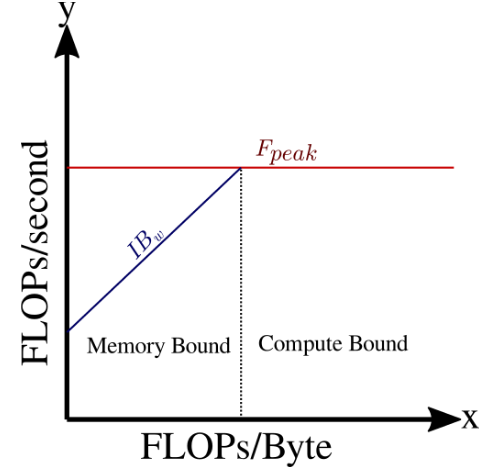

# Getting to know your hardware - Estimating Performance

In this section you will learn about


* How to assess and characterize peak performance and bandwidth using vendor specifications and back-of-the-envelope calculations
* Performance differences between the CPU and GPU
* The PCIe switch and its place as a potential bottleneck for GPU computing


## Gathering Specification Sheets

A good place to get started with familiarizing yourself with hardware is to seek out whitepapers and specification sheets. Whitepapers, from the hardware vendors or independent third parties, typically have write ups that explain specific hardware layout and usually share benchmarks that document empirical performance metrics. Whitepapers often outline features specific to a make/model of GPU and how to leverage these features for optimal performance. Specification sheets from the hardware vendors typically provide details such as the memory and compute clock frequencies, number of compute units / streaming multiprocessors, global memory size and bus width, etc. Both resources provide you with the necessary information for understanding potential performance of the hardware, while white papers often show _how_ to obtain the best possible performance.

Specification sheets can normally be found on the vendors website and are typically listed for each GPU make and model. The list below provides a few examples for a few popular GPUs in High Performance Computing.


* [AMD CDNA MI100 “Whitepaper”](https://www.amd.com/system/files/documents/amd-cdna-whitepaper.pdf)
* [Nvidia Volta architecture “Whitepaper”](https://images.nvidia.com/content/volta-architecture/pdf/volta-architecture-whitepaper.pdf)
* [Nvidia V100 Datasheet / Specification Sheet](https://images.nvidia.com/content/technologies/volta/pdf/volta-v100-datasheet-update-us-1165301-r5.pdf)

## Back-of-the-envelope calculations

Once you’ve gathered specification sheets from the hardware vendor, you can use some very basic calculations along-side system utilities, to verify that your operating system sees hardware that matches the vendor’s specifications.  Carrying out these back-of-the-envelope calculations is a useful way for you to get familiar with your hardware.

Keeping the high level view from Figure 1.2.1 in mind, what we aim to find with these calculations are the following :


1. CPU to CPU-RAM Theoretical Peak Bandwidth
2. CPU Theoretical Peak FLOPS
3. CPU to GPU (PCIe switch) Theoretical Peak Bandwidth
4. GPU to GPU-RAM (Global Memory) Theoretical Peak Bandwidth
5. GPU Theoretical Peak FLOPS


### PCIe Bandwidth

On dedicated GPU platforms, all data communicated between the GPU and CPU occurs over the PCIe switch. Because of this, it is a critical hardware component that can heavily influence the overall performance of your application. In this section, the key features and descriptors of a PCI  that you need to be aware of in order to calculate the theoretical PCI Bandwidth. Knowing how to calculate this number, on-the-fly, is useful for estimating possible performance limiters when porting your application to GPUs. 

The PCIe switch is a physical component that dedicated GPUs are attached to. They allow for communication between the CPU and GPU. Communication occurs over multiple PCIe lanes. We’ll start by presenting a formula for the theoretical bandwidth, and then explain each term. 


\begin{equation}
  B_w = N \cdot R \cdot O
\end{equation}

where $N$ is the number of PCIe Lanes, $R$ is the transfer rate per lane, and $O$ is an [overhead factor associated with Transaction Layer Packet protocol]( https://www.xilinx.com/support/documentation/white_papers/wp350.pdf )

Theoretical Bandwidth is measured in units of Gigabytes per second ($\frac{GB}{s}$). It is calculated by multiplying the number of lanes and the maximum transfer rate for each lane and converting from bits to Bytes. The conversion is left in the formula since the transfer rates are usually reported in Gigabits per second. Alternatively, you may see GigaTransfers per second ($\frac{GT}{s}$); these units are equivalent to $\frac{GB}{s}$. Finally, an overhead factor is applied.


#### PCIe Lanes

The number of lanes of a PCI bus can be found by looking through manufacturer specifications, or by a number of tools available on Linux platforms. Keep in mind that some of these tools may require root privileges. If you do not have these privileges, it is best to consult your system administrator to find out this information. Nonetheless, we will present two options for determining the number of PCIe lanes.

A common utility, available on Linux systems is lspci. This utility will list all components attached to the motherboard. We can use the grep regular expression tool to filter only the PCI Bridge. The following command will show you the vendor information and the device name with the number of PCIe lanes. For this example, “(x16)” in the output indicates that there are 16 lanes.


```
$ lspci -vmm | grep "PCI bridge" -A2
Class:	PCI bridge
Vendor:	Intel Corporation
Device:	Sky Lake PCIe Controller (x16)
Alternatively, dmidecode provides similar information.
$ dmidecode | grep "PCI"
PCI is supported
Type: x16 PCI Express
```


#### Transfer rates

The maximum transfer rates for each lane in a PCIe bus can directly be determined by its design Generation. Table 1 below shows the maximum transfer rate per PCI Lane and PCI Direction. 

<table>
  <tr>
   <td>
<table>
  <tr>
   <td><strong>PCIe Generation</strong>
   </td>
   <td><strong>Maximum Transfer Rate</strong>
   </td>
  </tr>
  <tr>
   <td>Gen1
   </td>
   <td>2.5 Gb/s
   </td>
  </tr>
  <tr>
   <td>Gen2
   </td>
   <td>5.0 Gb/s
   </td>
  </tr>
  <tr>
   <td>Gen3
   </td>
   <td>8.0 Gb/s
   </td>
  </tr>
  <tr>
   <td>Gen4
   </td>
   <td>16 Gb/s
   </td>
  </tr>
</table>


   </td>
  </tr>
  <tr>
   <td><span style="text-decoration:underline;">Table 1</span> : PCIe Generations and Transfer Rates.

   </td>
  </tr>
</table>


If you don’t know the Generation of your PCIe Bus, you can use lspci to learn this information. In all of the information output by lspci, we are looking for the Link Capacity for the PCIe switch. In the output, Link Capacity is abbreviated LnkCap.


```
$ sudo lspci -vvv | grep -E 'PCI|LnkCap'
00:01.0 PCI bridge: Intel Corporation Sky Lake PCIe Controller (x16) (rev 07)
		LnkCap:	Port #2, Speed 8GT/s, Width x16, ASPM L0s L1, Exit Latency L0s
```


Since we know the max transfer rate directly from this output, we can use this in the bandwidth formula directly. It’s also helpful to know that this speed can also be aligned with the Generation. In this case, the output indicates that we are working with a Gen3 PCIe system.


#### Overhead Rates

Transmitting data across the PCI requires additional overhead. Generation 1 and 2 standards stipulate that 10 bytes are transmitted for every 8 bytes of useful data. Generation 3 and 4 transmits 130 Bytes for every 128 Bytes. These conditions can be translated into an overhead factor. The overhead factor is the ratio of the number of usable bytes over the total bytes transmitted. Table 2 shows the overhead factors 


<table>
  <tr>
   <td>

<table>
  <tr>
   <td><strong>PCIe Generation</strong>
   </td>
   <td><strong>Overhead Factor</strong>
   </td>
  </tr>
  <tr>
   <td>Gen1
   </td>
   <td>0.8000
   </td>
  </tr>
  <tr>
   <td>Gen2
   </td>
   <td>0.8000
   </td>
  </tr>
  <tr>
   <td>Gen3
   </td>
   <td>0.9846
   </td>
  </tr>
  <tr>
   <td>Gen4
   </td>
   <td>0.9846
   </td>
  </tr>
</table>


   </td>
  </tr>
  <tr>
   <td><span style="text-decoration:underline;">Table 2 </span>: PCIe Generations and Overhead factors

   </td>
  </tr>
</table>


Now that we have all of the information needed, let’s estimate the theoretical bandwidth through an example, using output shown in the previous sections.


#### Example 1 : PCIe Bandwidth Calculation 

We have identified that we have a Gen3 PCIe system with 16 lanes. Calculate the Theoretical Peak Bandwidth for this system. Gen3 systems have a maximum transfer rate of $R = 8.0 \frac{Gb}{s}$ per lane and an overhead factor of $O = 0.9846$. With $N=16$ lanes, the Theoretical Bandwidth is $15.7536 \frac{GB}{s}$, as shown below.

\begin{equation}
  B_w (\frac{GB}{s}) = 16 \times 8.0 \frac{Gb}{s} \times 0.9846 \times \frac{1 B}{8 b} = 15.7536 \frac{GB}{s}
\end{equation}
    

   </td>
  </tr>
</table>


#### Reference Data for PCIe Theoretical Peak Bandwidth
Although you can do this calculation for each system you encounter, Table 3 summarizes the theoretical bandwidth for current PCIe systems.


<table>
  <tr>
   <td>

<table>
  <tr>
   <td>Generation/Lanes
   </td>
   <td>x2
   </td>
   <td>x4
   </td>
   <td>x8
   </td>
   <td>x16
   </td>
  </tr>
  <tr>
   <td>Gen1
   </td>
   <td>0.5000
   </td>
   <td>1.0000
   </td>
   <td>2.0000
   </td>
   <td>4.0000
   </td>
  </tr>
  <tr>
   <td>Gen2
   </td>
   <td>1.0000
   </td>
   <td>2.0000
   </td>
   <td>4.0000
   </td>
   <td>8.0000
   </td>
  </tr>
  <tr>
   <td>Gen3
   </td>
   <td>1.9692
   </td>
   <td>3.9384
   </td>
   <td>7.8768
   </td>
   <td>15.7536
   </td>
  </tr>
  <tr>
   <td>Gen4 
   </td>
   <td>3.9384
   </td>
   <td>7.8768
   </td>
   <td>15.7536
   </td>
   <td>31.5072
   </td>
  </tr>
</table>


   </td>
  </tr>
  <tr>
   <td>Table 3 : PCIe Theoretical Peak Bandwidths ( GB/s ) for Gen1 - Gen4

   </td>
  </tr>
</table>


### Memory Bandwidth

To better understand memory bandwidth calculations it is useful to think of the connection between memory and a compute unit as a multi-lane highway. On this highway, traffic is allowed to flow at a regular frequency with each lane having one vehicle at a time. In this fictitious mental model, all vehicles are the same size and move at the same rate from one end of the highway to the other. With this configuration, there are two ways to control the rate at which vehicles move across the highway


1. Change the frequency at which vehicles enter the highway
2. Change the number of lanes on the highway

We can express this mathematically as

\begin{equation}
\frac{vehicles}{second} = \frac{1 vehicle}{lane} \times N \frac{lane}{cycle} \times f \frac{cycle}{second}
\end{equation}

\begin{equation}
r = N \times f
\end{equation}

These equations depict the unit analysis used to calculate the rate ( in $\frac{vehicles}{second}$ ). Essentially, the rate is calculated on the assumption that in each cycle that $N$ lanes are open for travel and one vehicle is allowed per lane. Together, this gives $N$ vehicles traversing the highway per cycle. To convert this to units of $\frac{vehicles}{second}$, we multiply by the number of cycles per second. 

On your computer, the highway from this model is called the **_memory bus_**. The frequency in this model corresponds to the **_memory clock frequency_** and the number of lanes on the highway is the **_bus width_**. Additionally, each vehicle corresponds to a single bit of data that is transmitted across the memory bus. Using this analogy, we can write a formula for the theoretical peak memory bandwidth as

\begin{equation}
b_w = N \times f
\end{equation}

Where

* $b_w$ is the theoretical peak memory bandwidth in units of $\frac{bits}{second}$
* $N$ is the memory bus width, and is usually expressed in units of $bits$
* $f$ is the memory clock frequency, and is usually expressed in units of $Hz$. Note that $1 Hz = \frac{1}{second}$


Often, we want to express the memory bandwidth in $\frac{bytes}{second}$. To convert from $\frac{bits}{second}$ to $\frac{bytes}{second}$, we can use the definition $1 byte = 8 bits$ to get

\begin{equation}
B_w = \frac{1}{8}N \times f
\end{equation}


### FLOPS Calculations

Way back in the day, calculators were people whose jobs was solely to perform arithmetic (or calculus) operations by hand. Imagine going to an office building, where there are $M$ individuals who, on average can calculate one multiply and one addition operation every $T$ seconds. Just using these basic assumptions, these human calculators can perform $\frac{2M}{T}$ floating-point operations per second on average. Suppose these human calculators can perform their calculations at the same pace as each other at a frequency of $f_c = \frac{1}{T} Hz$. Then, we can write the theoretical peak performance of this team of human calculators:

\begin{equation}
  F_{peak} = N \times 2M \times f_c
\end{equation}

This equation also serves as a good model for modern CPUs, which have $M$ compute cores that can perform a fused-multiply-add operation with each clock cycle. Many CPUs also have the ability to perform vector operations, which increases the number of floating point operations that can theoretically be done with each clock cycle. However, we'll reserve this discussion for a future section.

This equation is very similar to the equations for PCIe and memory bandwidth; this is because the model for understanding the rates at which processing can be done is based on similar principles.

1. Moving data or performing calculations is done at regular intervals; there is a clock frequency
2. A collection of synchronized components can perform a fixed amount of work with each clock cycle

In this particular model, the office building is your computer and the individuals performing calculations all day are analogous to individual cores on a computer chip. Each core is able to independently carry out a “fused-multiply-add” operation, which accounts for two floating point operations, every clock cycle.

From the equation for $F_{peak}$, we can see that the compute performance of a computer depends on the number of cores available for floating point operations and the frequency at which those operations are executed. Keep in mind that the models presented above are an incredible simplification of what is really going on on your system and is only meant to provide upper bounds on performance. When vendors report “theoretical peak” performance metrics, they are referring to simple calculations like those shown in these equations. 

In reality, there are multiple levels of cache memory in addition to compute registers to worry about. In practice, different algorithms have their own requirements on memory layout and the types of compute operations that need to be carried out. Additionally, the choice in programming language, compiler, operating system, and other abstraction layers influence the end performance of your code. Nonetheless, understanding the limits of your system and your application’s measured performance can help you assess how much more performance you can expect out of your application on a specific target architecture.


### Roofline Modeling

In real applications, memory and compute operations are orchestrated together in order to carry out more complex algorithms. In order to perform compute operations on data, that data needs to be read from memory and brought to a compute register. Additionally, after computing, the results typically need to be written back to memory. Because of this, a team at UC Berkeley’s Parallel Computing Laboratory proposed the [Roofline Performance Model](https://people.eecs.berkeley.edu/~kubitron/cs252/handouts/papers/RooflineVyNoYellow.pdf) (in 2008).

A Roofline diagram is used to depict peak performance of various hardware components and to identify which hardware is limiting application performance. The Roofline Model is based on simple scale analysis to relate bandwidth and compute performance.

\begin{equation}
F = I \times B_w
\end{equation}

In this equation,

* $F$  is the compute performance and has units of  $\frac{FLOPs}{second}$
* $I$ is the “arithmetic intensity” and has units of $\frac{FLOPs}{Byte}$
* $B_w$ is the bandwidth and has units of $\frac{Bytes}{second}$

The arithmetic intensity is a property of an algorithm implemented to run on given hardware. Given the arithmetic intensity, the achieved performance is limited by the minimum of $F_{peak}$ and $F$. A roofline diagram is a log-log plot with the compute performance on the y-axis and the arithmetic intensity on the x-axis. To understand how to sketch a roofline diagram, we can take a logarithm of $F$ to get

\begin{equation}
\log_{10}(F) = \log_{10}(I) + \log_{10}(B_w)
\end{equation}

To start, you can draw a horizontal line at the value of $F_{peak}$. Then, you can draw a line at a 45 degree angle that intercepts the y-axis at $y=\log_{10}(B_w)$. Figure 1.3.1 shows a depiction of a Roofline diagram. The red line is the peak compute performance for a given hardware. The  blue line is the performance roof for a memory bound kernel. On a roofline diagram, the blue and red lines are fixed for a given system. 


<table>
  <tr>
   <td>

   

   </td>
  </tr>
  <tr>
   <td>Figure 1 : Depiction of a Roofline diagram showing compute performance on the y-axis and the arithmetic intensity on the x-axis.
   </td>
  </tr>
</table>


A kernel’s peak potential performance is dictated by its arithmetic intensity. There is a value for the arithmetic intensity that is specific to the hardware that delineates between an application being compute bound or memory bound.

\begin{equation}
I_0 = \frac{F_{peak}}{B_w}
\end{equation}

The Roofline model is useful for understanding the limits of your hardware and the potential peak performance of an algorithm on that hardware. So far, we’ve only discussed the Roofline model in the context of RAM bandwidth and peak performance based on FMA’s. There are other roofs that can be calculated for vector units / vectorization and different levels of memory. Knowing where your software sits on the roofline diagram is helpful for understanding whether or not there is more performance you can obtain on a given platform. 

For now, you should focus on being able to characterize hardware using peak performance, peak memory bandwidth, and the roofline model. At this point, you should be able to sketch a roofline diagram for hardware from vendor specifications and some hand-calculations.


