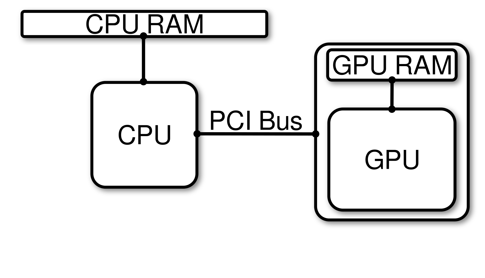
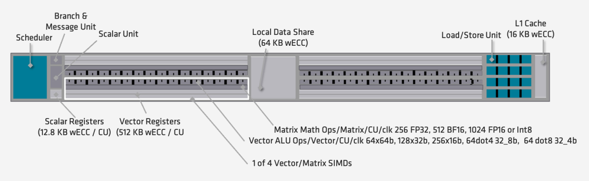

# GPU Accelerated Platforms

In this section you will learn about

* A simple model for thinking about GPU accelerated platforms
* AMD&reg; GPU architectures
* Nvidia&reg; GPU architectures (Coming soon)

## A simple model

<table>
  <tr>
   <td>

   </td>
  </tr>
  <tr>
   <td><strong>Figure 1</strong> : A conceptual diagram of a simple GPU accelerated system that has one CPU socket and a GPU connected to that socket over a PCI Bus. 
   </td>
  </tr>
</table>

Figure 1 is a conceptual diagram of a simple GPU accelerated system that has one CPU socket and a GPU connected to that socket over a PCIe switch. On GPU accelerated platforms, the CPU and GPU have their own memory spaces. Because of this, any programming model for leveraging GPUs needs to be able to manage this feature. The CPU and GPU exchange information (data and instructions) over a PCIe switch. All GPU programming models have tools for allocating memory on GPUs, copying data between CPU and GPU, and a mechanism to launch kernels (subroutines/functions) on the GPU.

## Performance Metrics
When comparing compute hardware, we typically talk about how much data can be read or written from memory per unit time and the number of floating-point operations per second (FLOPS). **Bandwidth** is the amount of data that can be read or written per unit time and it is typically expressed in bytes per second, usually with an appropriate SI prefix; for example,

* Megabytes per second ( $\frac{MB}{s}$ )
* Gigabytes per second ( $\frac{GB}{s}$ ) 
* Terabytes per second ( $\frac{TB}{s}$ ) 

Floating-point operations per second, or FLOPS, are a measure of the number of addition, subtraction, and multiplication operations that can be performed per second. Similar to bandwidth, FLOPS are usually prefixed with an appropriate SI prefix.

* Giga-FLOPS ( $GFLOPS$ )
* Tera-FLOPS ( $TFLOPS$ )
* Peta-FLOPS ( $PFLOPS$ )
* Exa-FLOPS ( $EFLOPS$ ) 

For reference, Table 1 provides a list of SI prefixes along with the symbol and associated power of 10.

<table>
  <tr>
   <td>

<table>
  <tr>
   <td><strong>SI Prefix</strong>
   </td>
   <td><strong>Symbol</strong>
   </td>
   <td>
\begin{equation}
10^{n}
\end{equation}
   </td>
  </tr>
  <tr>
   <td>yotta
   </td>
   <td>
\begin{equation}
Y
\end{equation}
   </td>
   <td>
\begin{equation}
10^{24}
\end{equation}
   </td>
  </tr>
  <tr>
   <td>zetta
   </td>
   <td>
\begin{equation}
Z
\end{equation}
   </td>
   <td>
\begin{equation}
10^{21}
\end{equation}
   </td>
  </tr>
  <tr>
   <td>exa
   </td>
   <td>
\begin{equation}
E
\end{equation}
   </td>
   <td>
\begin{equation}
10^{18}
\end{equation}
   </td>
  </tr>
  <tr>
   <td>peta
   </td>
   <td>
\begin{equation}
P
\end{equation}
   </td>
   <td>
\begin{equation}
10^{15}
\end{equation}
   </td>
  </tr>
  <tr>
   <td>tera
   </td>
   <td>
\begin{equation}
T
\end{equation}
   </td>
   <td>
\begin{equation}
10^{12}
\end{equation}
   </td>
  </tr>
  <tr>
   <td>giga
   </td>
   <td>
\begin{equation}
G
\end{equation}
   </td>
   <td>
\begin{equation}
10^{9}
\end{equation}
   </td>
  </tr>
  <tr>
   <td>mega
   </td>
   <td>
\begin{equation}
M
\end{equation}
   </td>
   <td>
\begin{equation}
10^{6}
\end{equation}
   </td>
  </tr>
  <tr>
   <td>kilo
   </td>
   <td>
\begin{equation}
K
\end{equation}
   </td>
   <td>
\begin{equation}
10^{3}
\end{equation}
   </td>
  </tr>
  <tr>
   <td>hecto
   </td>
   <td>
\begin{equation}
H
\end{equation}
   </td>
   <td>
\begin{equation}
10^{2}
\end{equation}
   </td>
  </tr>
  <tr>
   <td>deka
   </td>
   <td>
\begin{equation}
da
\end{equation}
   </td>
   <td>
\begin{equation}
10^{1}
\end{equation}
   </td>
  </tr>
  <tr>
   <td>
   </td>
   <td>
   </td>
   <td>
\begin{equation}
10^{0}
\end{equation}
   </td>
  </tr>
  <tr>
   <td>deci
   </td>
   <td>
\begin{equation}
d
\end{equation}
   </td>
   <td>
\begin{equation}
10^{-1}
\end{equation}
   </td>
  </tr>
  <tr>
   <td>centi
   </td>
   <td>
\begin{equation}
c
\end{equation}
   </td>
   <td>
\begin{equation}
10^{-2}
\end{equation}
   </td>
  </tr>
  <tr>
   <td>milli
   </td>
   <td>
\begin{equation}
m
\end{equation}
   </td>
   <td>

\begin{equation}
10^{-3}
\end{equation}

   </td>
  </tr>
  <tr>
   <td>micro
   </td>
   <td>

\begin{equation}
\mu
\end{equation}

   </td>
   <td>

\begin{equation}
10^{-6}
\end{equation}

   </td>
  </tr>
  <tr>
   <td>nano
   </td>
   <td>
\begin{equation}
n
\end{equation}
   </td>
   <td>

\begin{equation}
10^{-9}
\end{equation}

   </td>
  </tr>
  <tr>
   <td>pico
   </td>
   <td>
\begin{equation}
p
\end{equation}
   </td>
   <td>

\begin{equation}
10^{-12}
\end{equation}

   </td>
  </tr>
  <tr>
   <td>femto
   </td>
   <td>
\begin{equation}
f
\end{equation}
   </td>
   <td>

\begin{equation}
10^{-15}
\end{equation}

   </td>
  </tr>
  <tr>
   <td>atto
   </td>
   <td>
\begin{equation}
a
\end{equation}
   </td>
   <td>

\begin{equation}
10^{-18}
\end{equation}

   </td>
  </tr>
  <tr>
   <td>zepto
   </td>
   <td>
\begin{equation}
z
\end{equation}
   </td>
   <td>

\begin{equation}
10^{-21}
\end{equation}

   </td>
  </tr>
  <tr>
   <td>yocto
   </td>
   <td>
\begin{equation}
y
\end{equation}
   </td>
   <td>

\begin{equation}
10^{-24}
\end{equation}

   </td>
  </tr>
</table>

   </td>
  </tr>
  <tr>
   <td> <strong>Table 1</strong> : Prefixes for use in the Internal System of Units (SI).

Thompson, A. and Taylor, B. N. "Guide for the Use of the International System of Units (SI)." NIST Special Publication SP811, 2008 ed. [http://physics.nist.gov/cuu/pdf/sp811.pdf](http://physics.nist.gov/cuu/pdf/sp811.pdf).

   </td>
  </tr>
</table>

To assess the potential performance of compute hardware, there are three recommended steps to obtain measures of peak potential bandwidth and FLOPS :

1. Research specification sheets from hardware designers, vendors, or manufacturers.
2. Verify reported specifications using back-of-the-envelope calculations and system utilities.
3. Run standard micro-benchmarks to exercise key hardware components.

In the next few sections, you will learn more about each of these steps. For now, we will simply provide ballpark estimates for peak bandwidth and FLOPS for various hardware components that you will later be able to prove.

<table>
  <tr>
   <td>

<table>
  <tr>
   <td><strong>Component 1</strong>
   </td>
   <td><strong>Component 2</strong>
   </td>
   <td><strong>Connection</strong>
   </td>
   <td><strong>Bandwidth</strong>
   </td>
  </tr>
  <tr>
   <td>CPU
   </td>
   <td>CPU Memory
   </td>
   <td>CPU Memory Bus
   </td>
   <td>
\begin{equation}
\mathcal{O}(100 GB/s)
\end{equation}
   </td>
  </tr>
  <tr>
   <td>CPU
   </td>
   <td>GPU
   </td>
   <td>PCIe Switch
   </td>
   <td>
\begin{equation}
\mathcal{O}(10 GB/s)
\end{equation}
   </td>
  </tr>
  <tr>
   <td>GPU Cores
   </td>
   <td>GPU Memory
   </td>
   <td>GPU Global Memory Bus
   </td>
   <td>
\begin{equation}
\mathcal{O}(1000 GB/s)
\end{equation}
   </td>
  </tr>
</table>

   </td>
  </tr>
  <tr>
   <td><strong>Table 2</strong> : Bandwidth references for the three connections on GPU accelerated platforms shown in Figure 1.

   </td>
  </tr>
</table>

In Figure 1, the CPU is connected to CPU RAM over a memory bus and to the GPU over a PCI Bus. The GPU is connected to GPU RAM through its own memory bus. Table 2 summarizes estimates of current theoretical peak bandwidth for moving data between the various hardware components in Figure 1. In general, GPUs have the potential to access memory at a higher rate than CPUs because the memory clock frequency on GPUs is higher than the memory clock frequency on CPUs and the memory bus on GPUs is wider. 

The PCIe switch is the least performant component of GPU accelerated systems and is typically the source of much agony when initially porting an application to the GPU. In the porting process, there is often a significant amount of data being transferred between the CPU and GPU. Although individual kernels may show significant performance gains, overall runtime can stagnate or become much worse. Because of this, it is critical to migrate as much of the application as possible to the GPU in order to minimize data transfers between the host and device.

In terms of compute performance, we typically look at the rate at which a device can perform floating point operations. This rate is determined by the number of compute cores that can execute instructions independently, and the clock frequency of the cores. GPUs typically have lower compute clock frequencies than CPUs. However, CPUs usually have only 10s of cores, while GPUs have 1000s which is what gives them their greater theoretical peak performance. Of course, reaching this performance requires that you are able to efficiently leverage these 1000s of cores. 

For current hardware, typical theoretical peak performance of CPUs is $\mathcal{O}(1 TFLOP)$ (at double precision), while GPUs are $\mathcal{O}(10 TFLOP)$.

Applications that seek to benefit from GPU acceleration and outperform CPUs must exploit the fact that GPUs have more cores while being aware of the lower compute clock speeds. This requires algorithms to be expressable with Same-Instruction-Multiple-Data (SIMD) and Same-Instruction-Multiple-Thread (SIMT) parallelism.

## GPU Architectures
GPU hardware is designed to provide large core counts relative to CPU architecture. While there are many similarities between GPUs designed by different vendors, there are also differences. In this material, when we say "architecture" we mean the hardware as well as the **instruction set architecture (ISA)**. An ISA is the abstract model of a computer and it defines how software interacts with hardware. ISA defines supported data types, how the hardware manages memory, and instructions the hardware can execute.

In this section, we'll present conceptual models for AMD&reg; and Nvidia&reg; GPU hardware, present the ISA for current high performance GPUs, and discuss a few specific high performance GPU models from each vendor.

### AMD&reg;
Advanced Micro-Devices (AMD&reg;) is a commercial hardware vendor that designs, manufactures, and licenses (for manufacturing) GPUs. When discussing GPUs from AMD&reg;, there are two ends of the spectrum to consider :

1. GPUs designed for gaming ( “RDNA&trade;” GPUs )
2. GPUs designed for high performance computing ( “CDNA&trade;” GPUs )

While both classes of GPUs are designed for general purpose computing, the RDNA&trade; class of GPUs are built to optimize frames/second for popular gaming applications, while the CDNA&trade; class of GPUs are built to optimize FLOPS in scientific computing. 

AMD's CDNA&trade; architectures
*Discuss Graphics Core Next (GCN) architecture and the relationship to CDNA&trade; and RDNA&trade;*

#### CDNA&trade; (Conceptual)

<table>
  <tr>
   <td>

   </td>
  </tr>
  <tr>
   <td><strong>Figure 3</strong> : This is a conceptual diagram of the CDNA&trade; GPU architecture from AMD&reg;.
   </td>
  </tr>
</table>

Figure 3 shows a conceptual diagram of the CDNA&trade; GPU architecture from AMD&reg;. The GPU consists of

* A Command Processor
* "Global" GPU RAM
* L2 Cache
* A set of Shader Engines, each of which consist of a set of Compute Units that share a workload manager

For compute operations, each shader engine handles tasks received by the Command Processor through its Workload Manager. The Workload Manager is responsible for queueing work across the Compute Units within its Shader Engine. All of the Compute Units share the L2 Cache, which provides a faster (but smaller) bank of memory in comparison to the Global GPU RAM. 

<table>
  <tr>
   <td>

   </td>
  </tr>
  <tr>
   <td><strong>Figure 4</strong> : This is a diagram of a Compute Unit in the CDNA1 MI100 architecture, taken from <a href="https://www.amd.com/system/files/documents/amd-cdna-whitepaper.pdf">AMD&reg;'s CDNA&trade;1 Whitepaper</a>
.
   </td>
  </tr>
</table>

The view of the GPU hardware presented in Figure 3 is a macro view of the GPU architecture. The Compute Units have their own micro-architecture, as shown in Figure 4. Each CU is equipped with a Wavefront Scheduler, Vector Registers, Scalar Registers, 4x 16-wide Vector Execution Units, a Scalar Unit, Shared Memory, and L1 Cache. The CDNA1 Compute Unit architecture, which is depicted in Figure 4, also introduced matrices as first class data types (in addition to scalars and vectors) and provided Matrix-Fused-Multiply-Add instructions.

#### CDNA1&trade; (MI100)

<table>
  <tr>
   <td>
   
   </td>
  </tr>
  <tr>
   <td><strong>Figure 5</strong> : This is a block diagram of the AMD&reg; CDNA&trade;1 Compute Unit architecture taken from <a href="https://www.amd.com/system/files/documents/amd-cdna-whitepaper.pdf">AMD&reg;'s CDNA&trade;1 Whitepaper</a> .
   </td>
  </tr>
</table>

The MI100 series of GPUs is based on the CDNA1&trade; architecture. It is composed of 8 Shader Engines that each have 15 Compute Units, giving a total of 120 CUs, and 32 GB Global memory with a peak memory bandwidth of 1.2 TB/s. The L2 cache is shared across all CU’s and has an aggregate capacity of 8MB and a theoretical peak bandwidth of about 3TB/s. The MI100 GPU is connected to the host via a PCIe 4 interface that provides 32 GB/s one-way bandwidth.

The architecture of each compute unit is shown in Figure 5. For the MI100 GPU specifically, each compute unit has four vector execution units with Matrix Engines for computing “Matrix-Fused Multiply Add (MFMA)” operations, four vector register files and 64 KB Local Memory.

#### CDNA2&trade; (MI200)

<table>
  <tr>
   <td>
   
   </td>
  </tr>
  <tr>
   <td><strong>Figure 6</strong> : This is a block diagram of the AMD&reg; CDNA&trade;2 MI200 Graphic Compute Die architecture taken from <a href="https://www.amd.com/system/files/documents/amd-cdna2-white-paper.pdf">AMD&reg;'s CDNA&trade;2 Whitepaper</a> .
   </td>
  </tr>
</table>

Figure 6 shows a block diagram of AMD&reg;'s CDNA2 (MI200) Graphics Compute Die. The CDNA2 GCD architecture reduced the number of compute units per GCD from 120 (CDNA1) to 112 (CDNA2). HowevNotable improvements, relative to the CDNA1 architecture include:

* CDNA2 Matrix FMAs support FP64 matrix operations (CDNA1 only supported FP32 matrix operations)
* CNDA2 introduced the Packed FP32 instructions, wich can execute two component vector instructions on FP32 data types for FMA, FADD, and FMUL operations.
* Theoretical peak L2 cache bandwidth is doubled relative to CDNA1 to approximately 6 $\frac{TB}{s}$
* Global memory capacity is increased to 64 GB per GCD (relative to CDNA1 32GB)

Additionally, the MI200 series of GPUs, called a "Multi-Chip Module", consist of two GCD's, giving a total of 224 compute units per GPU. Each GCD is connected through high speed on-die fabric. In practice, one physical MI200 card appears to the operating system as two distinct GPUs capable of executing work.
